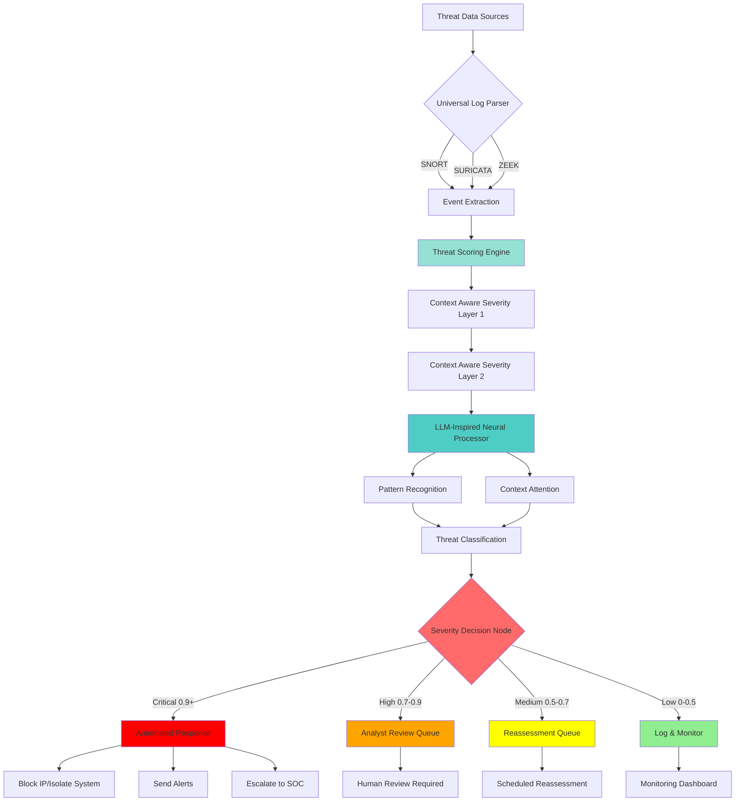

# DMARRSS - Decentralized Machine Assisted Rapid Response Security System

[]() []() []()

DMARRSS is an advanced threat detection and response system that leverages **LLM-inspired architecture** and **neural networks** to intelligently detect, classify, and prioritize security threats in distributed systems. The system processes logs from industry-standard security tools (SNORT, SURICATA, ZEEK) and applies sophisticated scoring algorithms with Context Aware Event Severity Layers to identify critical threats and automate response actions.

## 🎯 Key Features

- **LLM-Inspired Pattern Recognition**: Neural network architecture inspired by transformer models for advanced threat pattern detection
- **Context-Aware Event Severity Layers**: Dual-layer severity assessment system for precise threat classification
- **Multi-Source Log Ingestion**: Native support for SNORT, SURICATA, and ZEEK log formats
- **Neural Threat Prioritization**: Deep learning-based classification with confidence scoring
- **Automated Response Actions**: Intelligent response system with configurable severity-based actions
- **Modular Architecture**: Clean, extensible design with separate components for parsing, scoring, classification, and response
- **Real-time Processing**: High-performance pipeline capable of processing thousands of events per second

## 🗺️ Live Codebase Mindmap

Auto-generated on each push: **repo-map.html** (via GitHub Pages and CI artifact).

When Pages is enabled, it will be served at: `https://<owner>.github.io/<repo>/repo-map.html`

The mindmap provides an interactive visualization of the entire codebase structure, including:
- Language distribution and file statistics
- Directory hierarchy with expandable/collapsible nodes
- Quick navigation to understand project organization

## 🏗️ Architecture

DMARRSS implements a multi-stage pipeline that transforms raw security logs into actionable threat intelligence:



### Pipeline Stages

1. **Input Layer**: Multi-format log ingestion with auto-detection
2. **Parsing Layer**: Structured event extraction from security logs
3. **Scoring Layer**: Composite threat scoring using weighted components:
   - Pattern matching (30%)
   - Context relevance (25%)
   - Historical severity (20%)
   - Source reputation (15%)
   - Anomaly detection (10%)
4. **Neural Processing Layer**: LLM-inspired classification with attention mechanisms
5. **Severity Assessment**: Dual-layer context-aware severity determination
6. **Response Layer**: Automated action execution based on threat level

## 📋 Requirements

- Python 3.8 or higher
- PyTorch 2.0+
- NumPy, Pandas, scikit-learn
- PyYAML for configuration management

## 🚀 Installation

### Quick Start

```bash
# Clone the repository
git clone https://github.com/folkvarlabs/DMARRSS.git
cd DMARRSS

# Install dependencies
pip install -r requirements.txt

# Run the demo
python3 scripts/demo.py
```

### Verify Installation

```bash
# Run tests to verify installation
python3 -m pytest tests/ -v
```

All 33 tests should pass successfully.

## 💻 Usage

### Basic Usage

```python
from src.dmarrss_pipeline import DMARRSSPipeline

# Initialize the pipeline
pipeline = DMARRSSPipeline()

# Process a single log line
log_line = "[**] [1:2024364:1] ET MALWARE Detected [**] [Priority: 1] {TCP} 203.0.113.50:54321 -> 192.168.1.100:443"
result = pipeline.process_log_line(log_line)

print(f"Threat Score: {result['threat_score']}")
print(f"Severity: {result['severity']}")
print(f"Response Action: {result['response_action']['action']}")
```

### Processing Log Files

```python
# Process an entire SNORT log file
events = pipeline.process_log_file('path/to/snort_alerts.log', format_hint='snort')

# Get high-priority events
high_priority = pipeline.get_high_priority_events(events)

# Generate summary statistics
summary = pipeline.generate_summary(events)
print(f"Critical Events: {summary['by_severity']['critical']}")
print(f"Average Threat Score: {summary['threat_scores']['average']}")
```

### Custom Configuration

```python
# Load with custom configuration
pipeline = DMARRSSPipeline(config_path='path/to/custom_config.yaml')
```

## ⚙️ Configuration

DMARRSS is highly configurable through `config/dmarrss_config.yaml`:

```yaml
# System mode: decentralized, centralized_cloud, or centralized_onprem
system:
  mode: "decentralized"

# Severity thresholds for dual-layer assessment
severity_layers:
  layer1:
    critical: 0.9
    high: 0.7
    medium: 0.5
    low: 0.3

# Response actions by severity level
response_actions:
  critical:
    action: "automated_response"
    notify: true
    block: true
    escalate: true
  high:
    action: "analyst_review"
    notify: true
    escalate: true
```

## 🧪 Testing

DMARRSS includes comprehensive test coverage:

```bash
# Run all tests
python3 -m pytest tests/ -v

# Run specific test suite
python3 -m pytest tests/test_integration.py -v

# Run with coverage
python3 -m pytest tests/ --cov=src --cov-report=html
```

### Test Results

- ✅ Configuration and utilities: 5 tests
- ✅ Log parsing (SNORT/SURICATA/ZEEK): 9 tests
- ✅ Threat scoring engine: 10 tests
- ✅ End-to-end integration: 9 tests
- **Total: 33/33 tests passing**

## 📊 Sample Data

Sample security logs are included for testing and demonstration:

- `data/raw/sample_snort_alerts.log` - SNORT alert examples
- `data/raw/sample_suricata_eve.json` - SURICATA EVE JSON format

## 🔍 Components

### Core Modules

- **`src/preprocessing/`**: Log parsers for SNORT, SURICATA, and ZEEK
- **`src/models/threat_scorer.py`**: Threat scoring with Context Aware Severity Layers
- **`src/models/neural_processor.py`**: LLM-inspired neural classification network
- **`src/models/response_engine.py`**: Automated response action system
- **`src/utils/`**: Configuration management and logging utilities
- **`src/dmarrss_pipeline.py`**: Main pipeline orchestration

## 🎓 Example Output

```
Event: ET EXPLOIT Critical Remote Code Execution Attempt
────────────────────────────────────────────────────────
  Source:          SNORT
  Source IP:       203.0.113.50
  Dest IP:         192.168.1.100
  Threat Score:    0.700
  Severity:        HIGH
  Neural Severity: MEDIUM (conf: 0.276)
  Response:        analyst_review

Score Components:
  pattern_match        : 0.900
  context_relevance    : 0.900
  historical_severity  : 0.400
  source_reputation    : 0.700
  anomaly_score        : 0.200
```

## 🛠️ Development Roadmap

- [x] Core pipeline implementation
- [x] Multi-format log parsing (SNORT, SURICATA, ZEEK)
- [x] Threat scoring with Context Aware Severity Layers
- [x] LLM-inspired neural classification
- [x] Automated response system
- [x] Comprehensive test suite
- [ ] Fine-tuning on domain-specific cybersecurity datasets
- [ ] Distributed agent deployment
- [ ] Real-time streaming integration
- [ ] Web-based visualization dashboard
- [ ] Threat intelligence feed integration

## 📖 Documentation

- **Architecture Details**: See `docs/phase-breakdown.md`
- **Project Roadmap**: See `docs/roadmap.md`
- **API Reference**: See inline code documentation

## 🤝 Contributing

Contributions are welcome! Please follow these guidelines:

1. Fork the repository
2. Create a feature branch (`git checkout -b feature/amazing-feature`)
3. Commit your changes (`git commit -m 'Add amazing feature'`)
4. Push to the branch (`git push origin feature/amazing-feature`)
5. Open a Pull Request

## 📝 License

This project is licensed under the MIT License - see the LICENSE file for details.

## 🙏 Acknowledgments

- Inspired by Large Language Model architectures and transformer-based pattern recognition
- Built for compatibility with industry-standard security tools (SNORT, SURICATA, ZEEK)
- Designed for deployment in distributed security operations centers

## 📧 Contact

For questions, issues, or contributions, please open an issue on GitHub or contact the development team.

---

**DMARRSS** - Intelligent, automated threat detection and response for modern distributed systems.
