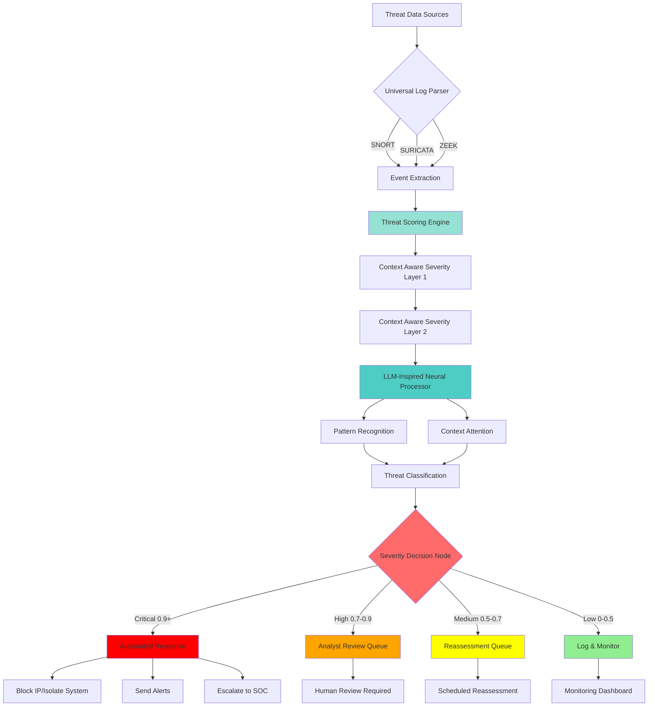

# DMARRSS - Decentralized Machine Assisted Rapid Response Security System

[]() []() []()

DMARRSS is an advanced threat detection and response system that leverages **LLM-inspired architecture** and **neural networks** to intelligently detect, classify, and prioritize security threats in distributed systems. The system processes logs from industry-standard security tools (SNORT, SURICATA, ZEEK) and applies sophisticated scoring algorithms with Context Aware Event Severity Layers to identify critical threats and automate response actions.

## 🎯 Key Features

- **LLM-Inspired Pattern Recognition**: Neural network architecture inspired by transformer models for advanced threat pattern detection
- **Context-Aware Event Severity Layers**: Dual-layer severity assessment system for precise threat classification
- **Multi-Source Log Ingestion**: Native support for SNORT, SURICATA, and ZEEK log formats
- **Neural Threat Prioritization**: Deep learning-based classification with confidence scoring
- **Automated Response Actions**: Intelligent response system with configurable severity-based actions
- **Modular Architecture**: Clean, extensible design with separate components for parsing, scoring, classification, and response
- **Real-time Processing**: High-performance pipeline capable of processing thousands of events per second

## 🏗️ Architecture

DMARRSS implements a multi-stage pipeline that transforms raw security logs into actionable threat intelligence:



### Pipeline Stages

1. **Input Layer**: Multi-format log ingestion with auto-detection
2. **Parsing Layer**: Structured event extraction from security logs
3. **Scoring Layer**: Composite threat scoring using weighted components:
   - Pattern matching (30%)
   - Context relevance (25%)
   - Historical severity (20%)
   - Source reputation (15%)
   - Anomaly detection (10%)
4. **Neural Processing Layer**: LLM-inspired classification with attention mechanisms
5. **Severity Assessment**: Dual-layer context-aware severity determination
6. **Response Layer**: Automated action execution based on threat level

## 📋 Requirements

- Python 3.8 or higher
- PyTorch 2.0+
- NumPy, Pandas, scikit-learn
- PyYAML for configuration management

## 🚀 Installation

### Quick Start

```bash
# Clone the repository
git clone https://github.com/PR-CYBR/DMARRSS.git
cd DMARRSS

# Install dependencies with development tools
pip install -e ".[dev]"

# Or production install
pip install -e .

# Train the neural model (creates dummy model for cold start)
dmarrss train

# Run the demo with synthetic events
dmarrss simulate --count 10
```

### Development Setup

```bash
# Install with pre-commit hooks
make setup

# Run tests
make test

# Run with coverage
make test-cov

# Lint and format code
make lint
make format
```

## 💻 Usage

### Command-Line Interface

DMARRSS provides a comprehensive CLI powered by Typer:

```bash
# Show help
dmarrss --help

# Run daemon in dry-run mode (default)
dmarrss run

# Run daemon with enforcement (executes actions)
dmarrss run --enforce

# Train/update neural model
dmarrss train
dmarrss train --force  # Force retraining

# Generate and process synthetic events
dmarrss simulate --count 20

# Start REST API server
dmarrss api --host 0.0.0.0 --port 8080

# Show version
dmarrss version
```

### Python API

```python
from dmarrss.parsers import SnortParser
from dmarrss.scoring.threat_scorer import ThreatScorer
from dmarrss.models.inference import ThreatInference
from dmarrss.decide.decision_node import DecisionNode
from dmarrss.store import Store
import yaml

# Load config
with open('config/dmarrss_config.yaml') as f:
    config = yaml.safe_load(f)

# Initialize components
store = Store("data/state/dmarrss.db")
scorer = ThreatScorer(config, store)
inference = ThreatInference()
decision_node = DecisionNode(config, scorer, inference)

# Parse event
parser = SnortParser()
log_line = "[**] [1:2024364:1] ET MALWARE Detected [**] [Priority: 1] {TCP} 203.0.113.50:54321 -> 192.168.1.100:443"
event = parser.parse(log_line)

# Make decision
decision = decision_node.decide(event)

print(f"Severity: {decision.severity}")
print(f"Threat Score: {decision.threat_score:.3f}")
print(f"Recommended Actions: {decision.recommended_actions}")
```

### REST API

Start the API server:

```bash
dmarrss api
```

API endpoints:

- `GET /` - API info and available endpoints
- `GET /status` - System status and model info
- `POST /ingest` - Ingest single event
- `POST /ingest/batch` - Ingest multiple events
- `GET /events` - Query events (with filters)
- `GET /decisions/{id}` - Get decision details
- `POST /actions/test` - Test action plugins
- `GET /metrics` - Prometheus metrics

Example API usage:

```bash
# Check status
curl http://localhost:8080/status

# Ingest event
curl -X POST http://localhost:8080/ingest \
  -H "Content-Type: application/json" \
  -d '{
    "source": "SNORT",
    "log_line": "[**] [1:2024364:1] ET MALWARE Detected [**] [Priority: 1] {TCP} 203.0.113.50:54321 -> 192.168.1.100:443"
  }'

# Get metrics
curl http://localhost:8080/metrics
```

## ⚙️ Configuration

DMARRSS is highly configurable through `config/dmarrss_config.yaml`:

### System Configuration

```yaml
system:
  mode: "decentralized"  # decentralized, centralized_cloud, centralized_onprem
  enforce: false          # Enable action execution (can override with DMARRSS_ENFORCE env var)
  data_dir: "./data"
```

### Log Ingestion

```yaml
ingest:
  snort:
    enabled: true
    files: ["./data/raw/sample_snort_alerts.log"]
  suricata:
    enabled: true
    files: ["./data/raw/sample_suricata_eve.json"]
  zeek:
    enabled: true
    files: ["./data/raw/sample_zeek_conn.log"]
```

### Threat Scoring

```yaml
scoring:
  weights:
    pattern_match: 0.30
    context_relevance: 0.25
    historical_severity: 0.20
    source_reputation: 0.15
    anomaly_score: 0.10
  cidr_include: ["10.0.0.0/8", "192.168.0.0/16"]
  reputation_csv: "./data/reputation/reputation.csv"
```

### Severity Thresholds

```yaml
severity_layers:
  layer1:
    critical: 0.90
    high: 0.70
    medium: 0.50
    low: 0.30
```

### Response Actions

```yaml
responses:
  CRITICAL: ["block_ip", "notify_webhook"]
  HIGH: ["notify_webhook"]
  MEDIUM: ["notify_webhook"]
  LOW: []
```

### Environment Variables

- `DMARRSS_ENFORCE` - Enable action execution (0=dry-run, 1=execute)
- `DMARRSS_WEBHOOK_URL` - Webhook URL for notifications

## 🐳 Docker Deployment

### Docker Compose (Recommended)

The easiest way to deploy DMARRSS with all services:

```bash
# Start all services (daemon, API, Prometheus, Grafana)
make docker-up

# Or manually
docker-compose up -d

# View logs
docker-compose logs -f dmarrss-daemon
docker-compose logs -f dmarrss-api

# Stop services
make docker-down
```

Services:
- **dmarrss-daemon**: Event processing daemon
- **dmarrss-api**: REST API server (port 8080)
- **prometheus**: Metrics collection (port 9090)
- **grafana**: Metrics visualization (port 3000)

### Docker Build

```bash
# Build image
make docker-build

# Or manually
docker build -t dmarrss:latest -f docker/Dockerfile .

# Run daemon
docker run -v $(pwd)/data:/app/data dmarrss:latest dmarrss run

# Run API
docker run -p 8080:8080 -v $(pwd)/data:/app/data dmarrss:latest dmarrss api
```

### Environment Variables for Docker

```bash
# Enable enforcement mode
docker run -e DMARRSS_ENFORCE=1 dmarrss:latest dmarrss run

# Set webhook URL
docker run -e DMARRSS_WEBHOOK_URL=https://hooks.example.com/webhook dmarrss:latest
```

## 🚀 Production Deployment

### Systemd Service

For Linux servers, a systemd service template is provided:

```bash
# Install service
sudo cp deploy/systemd/dmarrss.service /etc/systemd/system/
sudo systemctl daemon-reload

# Start service
sudo systemctl start dmarrss
sudo systemctl enable dmarrss

# Check status
sudo systemctl status dmarrss

# View logs
sudo journalctl -u dmarrss -f
```

**Note**: Edit the service file to set correct paths and user before installing.

## 🧪 Testing

DMARRSS includes comprehensive test coverage:

```bash
# Run all tests
make test

# Run with coverage report
make test-cov

# Run specific test file
pytest tests/test_parsers.py -v

# Run specific test
pytest tests/test_parsers.py::TestSnortParser::test_parse_snort_alert_with_priority -v
```

### Test Results

Current test coverage: **49%** (23/23 tests passing)

- ✅ Parser tests: SNORT, SURICATA, ZEEK format parsing
- ✅ Scoring tests: Threat scoring components and composite scores
- ✅ Decision tests: Severity classification and batch processing
- ✅ Action tests: Dry-run mode for all action plugins
- ✅ Integration tests: End-to-end pipeline with in-memory storage

### CI/CD

GitHub Actions workflows automatically:
- Run tests on Python 3.10, 3.11, 3.12
- Check code formatting (black, ruff)
- Run type checking (mypy)
- Build Docker images
- Publish releases to GHCR on tags

## 📊 Sample Data

Sample security logs are included for testing and demonstration:

- `data/raw/sample_snort_alerts.log` - SNORT alert examples
- `data/raw/sample_suricata_eve.json` - SURICATA EVE JSON format

## 🔍 Components

### Core Modules

- **`src/dmarrss/parsers/`**: Log parsers for SNORT, SURICATA, and ZEEK
  - Unified Event schema with Pydantic validation
  - Streaming-capable parsers
- **`src/dmarrss/scoring/threat_scorer.py`**: Config-driven composite threat scoring
  - Pattern matching, context relevance, historical severity
  - Source reputation, anomaly detection
- **`src/dmarrss/models/`**: Neural network threat classification
  - PyTorch MLP for tabular features
  - Model training and inference pipelines
  - Versioned model storage with metadata
- **`src/dmarrss/decide/decision_node.py`**: Decision engine
  - Combines scoring and neural predictions
  - Severity classification with confidence scores
- **`src/dmarrss/actions/`**: Action plugins with dry-run support
  - `block_ip.py`: Platform-specific firewall rules (Linux/Mac/Windows)
  - `isolate_host.py`: Network isolation
  - `notify_webhook.py`: Webhook notifications
- **`src/dmarrss/store.py`**: SQLite persistence layer
  - Events, decisions, actions, statistics
  - File position tracking for log tailers
- **`src/dmarrss/api.py`**: FastAPI REST server with Prometheus metrics
- **`src/dmarrss/cli.py`**: Typer-based command-line interface
- **`src/dmarrss/daemon.py`**: Autonomous daemon supervisor

## 🎓 Example Output

```
Event: ET EXPLOIT Critical Remote Code Execution Attempt
────────────────────────────────────────────────────────
  Source:          SNORT
  Source IP:       203.0.113.50
  Dest IP:         192.168.1.100
  Threat Score:    0.700
  Severity:        HIGH
  Neural Severity: MEDIUM (conf: 0.276)
  Response:        analyst_review

Score Components:
  pattern_match        : 0.900
  context_relevance    : 0.900
  historical_severity  : 0.400
  source_reputation    : 0.700
  anomaly_score        : 0.200
```

## 🛠️ Development Roadmap

- [x] Core pipeline implementation
- [x] Multi-format log parsing (SNORT, SURICATA, ZEEK)
- [x] Threat scoring with Context Aware Severity Layers
- [x] Neural network threat classification
- [x] Automated response system with dry-run
- [x] REST API with Prometheus metrics
- [x] Command-line interface
- [x] Docker and Docker Compose support
- [x] CI/CD with GitHub Actions
- [x] Comprehensive test suite (49% coverage)
- [ ] Async log tailers with watchdog
- [ ] Fine-tuning on domain-specific cybersecurity datasets
- [ ] Distributed agent deployment
- [ ] Web-based visualization dashboard
- [ ] Threat intelligence feed integration
- [ ] Increase test coverage to ≥85%

## 📖 Documentation

- **Architecture Details**: See `docs/phase-breakdown.md`
- **Project Roadmap**: See `docs/roadmap.md`
- **API Reference**: See inline code documentation

## 🤝 Contributing

Contributions are welcome! Please follow these guidelines:

1. Fork the repository
2. Create a feature branch (`git checkout -b feature/amazing-feature`)
3. Commit your changes (`git commit -m 'Add amazing feature'`)
4. Push to the branch (`git push origin feature/amazing-feature`)
5. Open a Pull Request

## 📝 License

This project is licensed under the MIT License - see the LICENSE file for details.

## 🙏 Acknowledgments

- Inspired by Large Language Model architectures and transformer-based pattern recognition
- Built for compatibility with industry-standard security tools (SNORT, SURICATA, ZEEK)
- Designed for deployment in distributed security operations centers

## 📧 Contact

For questions, issues, or contributions, please open an issue on GitHub or contact the development team.

---

**DMARRSS** - Intelligent, automated threat detection and response for modern distributed systems.
