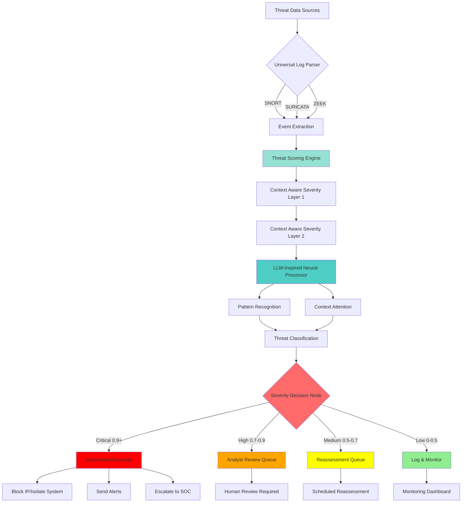
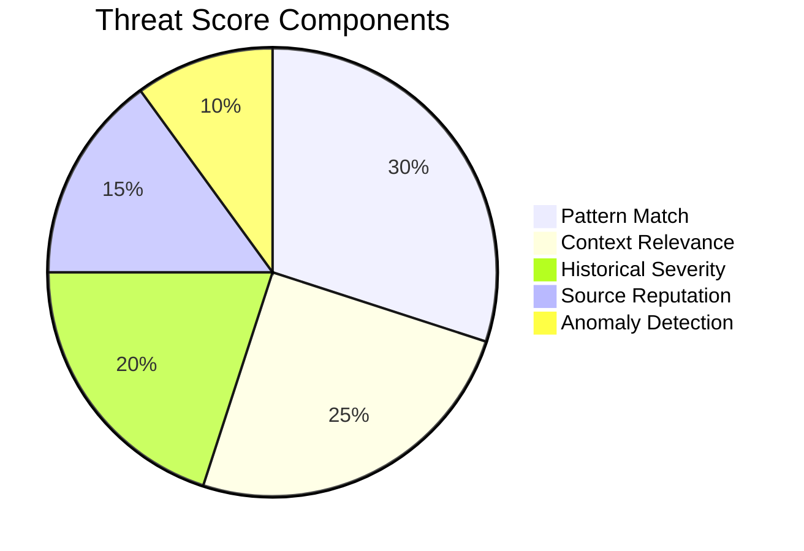
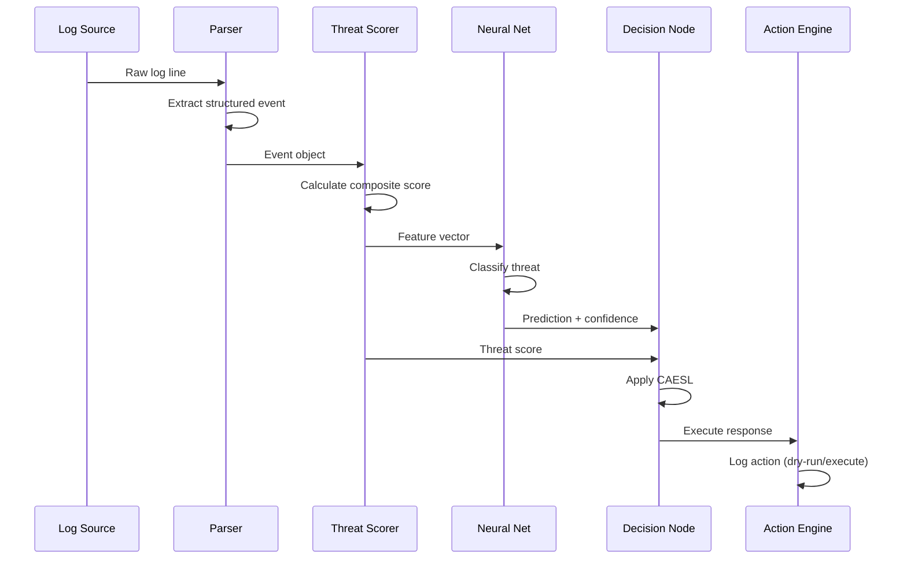
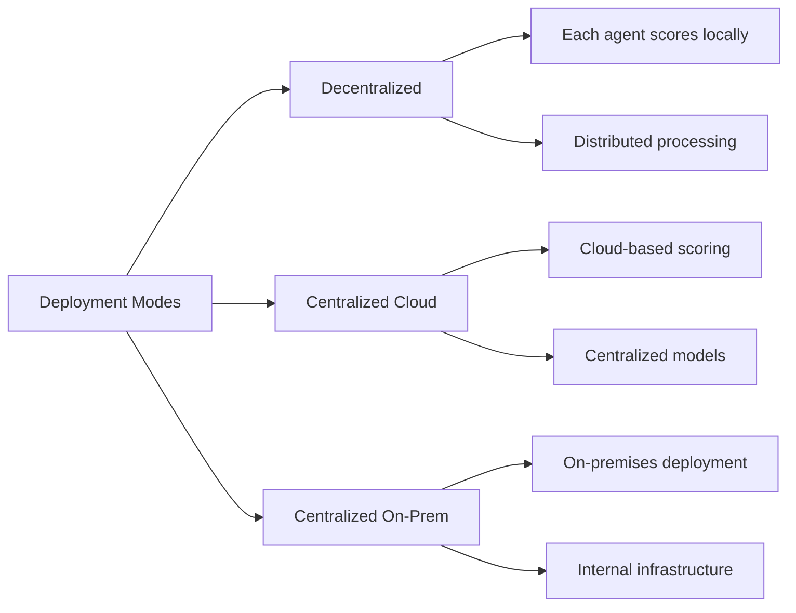

# Architecture

DMARRSS implements a multi-stage pipeline that transforms raw security logs into actionable threat intelligence.

## System Overview

The architecture consists of several key layers:

1. **Input Layer**: Multi-format log ingestion with auto-detection
2. **Parsing Layer**: Structured event extraction from security logs
3. **Scoring Layer**: Composite threat scoring using weighted components
4. **Neural Processing Layer**: LLM-inspired classification with attention mechanisms
5. **Severity Assessment**: Dual-layer context-aware severity determination
6. **Response Layer**: Automated action execution based on threat level

## Pipeline Flow



## Component Architecture

### Parsers

The parser layer supports multiple security log formats:

- **SNORT Parser**: Processes alert logs with classification and priority
- **SURICATA Parser**: Handles EVE JSON format with rich metadata
- **ZEEK Parser**: Parses connection logs and other ZEEK outputs

All parsers convert to a unified Event schema using Pydantic validation.

### Threat Scoring Engine

The scoring engine combines multiple factors with configurable weights:



**Default weights:**
- Pattern matching: 30%
- Context relevance: 25%
- Historical severity: 20%
- Source reputation: 15%
- Anomaly detection: 10%

### Neural Processing Layer

The LLM-inspired neural processor uses:

- Multi-layer perceptron (MLP) architecture
- Attention mechanisms for context awareness
- PyTorch backend for efficient computation
- Versioned model storage with metadata

### Decision Node

The decision node combines:
1. Composite threat score from the scoring engine
2. Neural network predictions with confidence scores
3. Context-aware severity layers (CAESL)

## Data Flow



## Storage Layer

DMARRSS uses SQLite for persistent storage:

- **Events table**: Raw and processed event data
- **Decisions table**: Decision history with scores
- **Actions table**: Action execution log
- **Statistics table**: Aggregated metrics
- **File positions**: Log tailer state tracking

## Deployment Modes

DMARRSS supports three deployment modes:



### Decentralized Mode

Each agent processes and scores events independently:
- Local threat scoring
- Independent decision making
- Minimal network overhead
- Suitable for edge deployments

### Centralized Cloud Mode

All events sent to cloud for processing:
- Unified threat intelligence
- Shared model updates
- Centralized monitoring
- Scale-on-demand

### Centralized On-Premises Mode

Internal infrastructure deployment:
- Data remains on-premises
- Centralized control
- Compliance-friendly
- Dedicated resources

## Core Modules

### `src/dmarrss/parsers/`

Log parsers for SNORT, SURICATA, and ZEEK with unified Event schema and Pydantic validation.

### `src/dmarrss/scoring/threat_scorer.py`

Config-driven composite threat scoring with pattern matching, context relevance, historical severity, source reputation, and anomaly detection.

### `src/dmarrss/models/`

Neural network threat classification with PyTorch MLP, model training and inference pipelines, and versioned model storage.

### `src/dmarrss/decide/decision_node.py`

Decision engine that combines scoring and neural predictions with severity classification and confidence scores.

### `src/dmarrss/actions/`

Action plugins with dry-run support:
- `block_ip.py`: Platform-specific firewall rules
- `isolate_host.py`: Network isolation
- `notify_webhook.py`: Webhook notifications

### `src/dmarrss/store.py`

SQLite persistence layer for events, decisions, actions, statistics, and file position tracking.

### `src/dmarrss/api.py`

FastAPI REST server with Prometheus metrics.

### `src/dmarrss/cli.py`

Typer-based command-line interface.

### `src/dmarrss/daemon.py`

Autonomous daemon supervisor for continuous operation.

## Configuration

All components are configured through `config/dmarrss_config.yaml`:

```yaml
system:
  mode: "decentralized"
  enforce: false
  data_dir: "./data"

ingest:
  snort:
    enabled: true
    files: ["./data/raw/sample_snort_alerts.log"]

scoring:
  weights:
    pattern_match: 0.30
    context_relevance: 0.25
    historical_severity: 0.20
    source_reputation: 0.15
    anomaly_score: 0.10

severity_layers:
  layer1:
    critical: 0.90
    high: 0.70
    medium: 0.50
    low: 0.30

responses:
  CRITICAL: ["block_ip", "notify_webhook"]
  HIGH: ["notify_webhook"]
  MEDIUM: ["notify_webhook"]
  LOW: []
```

## Performance Characteristics

- **Throughput**: Thousands of events per second
- **Latency**: Sub-millisecond scoring per event
- **Storage**: Efficient SQLite with indexing
- **Scalability**: Horizontal scaling in decentralized mode
- **Resource Usage**: Optimized for edge and cloud deployment

## Next Steps

- Explore the [API Reference](./api-reference.md) for integration
- Follow the [Deployment Guide](./deployment.md) for setup
- Check the [Roadmap](./roadmap.md) for upcoming features
